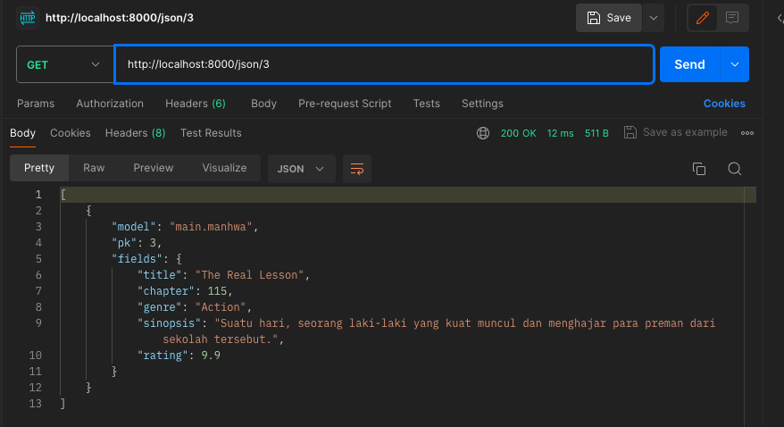

# Manhwa Tracker

## Tugas 2

[ ] Membuat sebuah proyek Django baru.
Pertama kita buat sebuah direktori utama dengan nama manhwa-tracker yang menampung semua file project kita, kemudian buka terminal pada path direktori untuk membuat virtual environment dengan perintah:

> python3 -m venv env 

Setelah itu, aktifkan virtual environment dengan perintah berikut:

> source env/bin/activate

Didalam direktori utama, buat file requirements.txt yang berisi dependencies yang kita perlukan nanti

```
django
gunicorn
whitenoise
psycopg2-binary
requests
urllib3
```

lakukan instalasi pada dependencies dengan mengetikkan perintah pada terminal direktori

> pip install -r requirements.txt 

Setelah itu, buat proyek django dengan perintah berikut:

> django-admin startproject manhwa_tracker . 

Proyek django dengan nama subdirektori manhwa_tracker telah ada di didalam direktori utama kita.

[ ] Membuat aplikasi dengan nama main pada proyek tersebut.

Untuk membuat aplikasi baru bernama main jalankan perintah ini pada terminal di direktori utama

> python3 manage.py startapp main

Kemudian daftarkan aplikasi main tersebut kedalam proyek. Dengan cara buka settings.py di dalam direktori manhwa_tracker, kemudian tambahkan main ke variabel INSTALLED_APPS.

```
    INSTALLED_APPS = [
    'main',
    'django.contrib.admin',
    'django.contrib.auth',
    'django.contrib.contenttypes',
    'django.contrib.sessions',
    'django.contrib.messages',
    'django.contrib.staticfiles',
]
```

[ ] Melakukan routing pada proyek agar dapat menjalankan aplikasi main.

buka berkas dengan nama urls.py di dalam direktori proyek manhwa_tracker untuk menambahkan routing ke proyek main.
sebelumnya impor fungsi include dari django.urls

```
    ...
    from django.urls import path, include
    ...
```

kemudian, tambahkan rute URL seperti berikut untuk mengarahkan ke tampilan main di dalam variabel urlpatterns.

```
    urlpatterns = [
    ...
    path('', include('main.urls')),
    ...
]
```

path('') tidak diisi agar halaman aplikasi main dapat diakses secara langsung

[ ] Membuat model pada aplikasi main dengan nama Item dan memiliki atribut wajib sebagai berikut.
name sebagai nama item dengan tipe CharField.
amount sebagai jumlah item dengan tipe IntegerField.
description sebagai deskripsi item dengan tipe TextField.

Pada manhwa tracker terdapat lima item, yakni title, chapter, genre, sinopsis, dan rating. 
* title sebagai judul dan genre sebagai jenis manhwa dengan tipe CharField.
* chapter sebagai jumlah episode dengan tipe IntegerField
* sinopsis sebagai deksripsi manhwa dengan tipe TextField
* rating sebagai rating manhwa dengan tipe FloatField

```
from django.db import models

# Create your models here.
class Manhwa(models.Model):
    title = models.CharField(max_length=255)
    chapter = models.IntegerField()
    genre = models.CharField(max_length=255)
    sinopsis = models.TextField()
    rating = models.FloatField()
```

[ ] Membuat sebuah fungsi pada views.py untuk dikembalikan ke dalam sebuah template HTML yang menampilkan nama aplikasi serta nama dan kelas kamu.

Buka berkas views.py pada direktori main, kemudian tambahkan fungsi show main dibawah baris impor

```
    def show_main(request):
    context = {
        'name': 'A. Nurcahaya Tampubolon',
        'class': 'PBP A'
    }

    return render(request, "main.html", context)
```

kemudian buka berkas main.html yang telah dibuat sebelumnya di direktori manhwa-tracker/main/templates. Kemudian ubah nama dan kelas  menjadi kode django untuk menampilkan nilai dari variabel yang telah didefenisikan dalam context.

```
    <h5>Name:</h5>
    <p>{{ name }}</p>
    <p></p>
    <h5>Class:</h5>
    <p>{{ class }}</p>
```

[ ] Membuat sebuah routing pada urls.py aplikasi main untuk memetakan fungsi yang telah dibuat pada views.py.

untuk membuat routing pada aplikasi main yaitu dengan membuat urls.py pada direktori aplikasi main kemudian menghubungkan juga dengan fungsi show_main

```
from django.urls import path

from main.views import show_main

app_name = 'main'

urlpatterns = [
    path('', show_main, name='show_main'),
]
```

[ ] Melakukan deployment ke PWS terhadap aplikasi yang sudah dibuat sehingga nantinya dapat diakses oleh teman-temanmu melalui Internet.

Pertama, kita melakukan register di http://pbp.cs.ui.ac.id/register. Kemudian login, buat New Project sesuai dengan nama direktori kita seperti manhwatracker.
Setelah itu, pada terminal direktori utama kita ketikkan perintah berikut:

```
git remote add pws http://pbp.cs.ui.ac.id/a.nurcahaya/manhwatracker
git branch -M master
git push pws master
```

Pertanyaan:
Jelaskan mengapa kita menggunakan virtual environment? Apakah kita tetap dapat membuat aplikasi web berbasis Django tanpa menggunakan virtual environment?
- Ada beberapa alasan mengapa kita menggunakan virtual environment dalam pengembangan aplikasi web Django:
  * Mengisolasi Dependencies: Virtual environment membantu mengisolasi dependencies (ketergantungan) project Django kita dari project Python lainnya di sistem kita. 
  * Meningkatkan Keamanan: Virtual environment membantu meningkatkan keamanan project kita dengan membatasi akses ke dependencies yang diinstal. Hal ini dapat membantu mencegah kerentanan keamanan dieksploitasi.
  * Mempermudah Debugging: Virtual environment dapat membantu mempermudah debugging project kita dengan memungkinkan kita untuk mengidentifikasi dan menyelesaikan masalah yang terkait dengan dependencies.
  * Mempermudah Deployment: Virtual environment dapat membantu mempermudah deployment project kita dengan memungkinkan kita untuk mengemas semua dependencies yang diperlukan bersama dengan project Anda.

- Ya, kita tetap dapat membuat aplikasi web berbasis Django tanpa menggunakan virtual environment. Namun, tidak disarankan untuk melakukan hal ini karena beberapa alasan yang disebutkan di atas.

Tanpa virtual environment, kita bisa:

* Mengalami konflik dan masalah kompatibilitas dengan dependencies.
* Menurunkan keamanan project Anda.
* Menghadapi kesulitan saat debugging project Anda.
* Mengalami kesulitan saat deploying project Anda.

Oleh karena itu, sangat disarankan untuk menggunakan virtual environment saat mengembangkan aplikasi web Django.Virtual environment dapat membantu kita menghindari berbagai masalah dan meningkatkan alur kerja pengembangan Anda.


Jelaskan apakah itu MVC, MVT, MVVM dan perbedaan dari ketiganya.
- MVC (Model-View-Controller), MVT (Model-View-Template), dan MVVM (Model-View-ViewModel) adalah pola desain arsitektur perangkat lunak yang populer untuk memisahkan berbagai aspek aplikasi.

**MVC:**

* **Model:** Menyimpan data dan logika aplikasi.
* **View:** Menampilkan data kepada pengguna dan menerima input pengguna.
* **Controller:** Mengontrol interaksi antara Model dan View, dan memproses input pengguna.

**MVT:**

* **Model:** Menyimpan data dan logika aplikasi.
* **View:** Menampilkan data kepada pengguna.
* **Template:** Menentukan struktur dan format View.

**MVVM:**

* **Model:** Menyimpan data dan logika aplikasi.
* **View:** Menampilkan data kepada pengguna.
* **ViewModel:** Bertindak sebagai perantara antara Model dan View, dan mengonversi data Model menjadi format yang dapat dipahami oleh View.

**Berikut adalah tabel yang menunjukkan perbedaan utama antara MVC, MVT, dan MVVM:**

| Fitur | MVC | MVT | MVVM |
|---|---|---|---|
| **Controller** | Ada | Tidak ada | Tidak ada |
| **Template** | Tidak ada | Ada | Tidak ada |
| **ViewModel** | Tidak ada | Tidak ada | Ada |
| **Pemisahan logika UI** | Sedang | Tinggi | Tinggi |
| **Pengujian unit** | Mudah | Mudah | Sedikit lebih sulit |
| **Kompleksitas** | Sedang | Rendah | Tinggi |

**Berikut adalah beberapa contoh penggunaan MVC, MVT, dan MVVM:**

* **MVC:** Cocok untuk aplikasi web dan desktop yang kompleks dengan banyak interaksi pengguna.
* **MVT:** Cocok untuk aplikasi web dan desktop yang sederhana dengan sedikit interaksi pengguna.
* **MVVM:** Cocok untuk aplikasi mobile dan desktop dengan UI yang kompleks dan data yang sering berubah.

**Kesimpulan:**

MVC, MVT, dan MVVM adalah pola desain arsitektur perangkat lunak yang populer dengan kelebihan dan kekurangannya masing-masing. Pilihan pola desain yang tepat tergantung pada kebutuhan dan kompleksitas aplikasi kita.

## Tugas 3
[ ] Apa perbedaan antara form POST dan form GET dalam Django?
>* Form Post mengirimkan data melalui method POST. Data disembunyikan di dalam body request. Sedangkan form Get mengirimkan data melalui method GET. Data ditampilkan di URL sebagai query parameters.
>* Form Post tidak ada batas ukuran data yang dikirim. Sedangkan form Get ada batasan ukuran data karena dibatasi oleh URL length limit.

[ ] Apa perbedaan utama antara XML, JSON, dan HTML dalam konteks pengiriman data?
>* XML memiliki tag/format terstruktur mirip HTML, ukuran filenya cenderung lebih besar, dan formatnya berbasis teks untuk menyimpan dan mentransfer data. XML juga lebih fleksibel dan self-descriptive, digunakan untuk integrasi sistem dan web services.
>* JSON memiliki format yang lebih sederhana mirip object literal di bahasa pemrograman, ukurannya kecil sehingga transfer data lebih cepat, formatnya ringan berbasis teks untuk pertukaran data, dan banyak digunakan untuk AJAX web dan mobile apps.
>* HTML adalah markup language untuk menampilkan konten web, berfokus pada tampilan dan presentation, dan tidak didesain secara spesifik untuk transfer data. Lebih banyak digunakan untuk menampilkan data daripada mentransfernya.

[ ] Mengapa JSON sering digunakan dalam pertukaran data antara aplikasi web modern?
>JSON tidak tergantung pada bahasa pemrograman apapun walaupun namanya JavaScript Object Notation, formatnya juga berbasis teks sehingga ukurannya kecil. JSON juga memiliki struktur yang sederhana dan ringan, memudahkan parsing dan pengiriman melalui jaringan.

[ ] Jelaskan bagaimana cara kamu mengimplementasikan checklist di atas secara step-by-step (bukan hanya sekadar mengikuti tutorial).
>[ ] Membuat input form untuk menambahkan objek model pada app sebelumnya.

Pertama buat folder templates pada direktori utama, yaitu manhwa-tracker. Kemudian isi templates tersebut dengan berkas HTML bernama base.html. Kemudian kita mengisi berkas tersebut dengan kode dibawah ini.
```

<!DOCTYPE html>
<html lang="en">
  <head>
    <meta charset="UTF-8" />
    <meta name="viewport" content="width=device-width, initial-scale=1.0" />
     
  </head>

  <body>
     
  </body>
</html>
```
Kemudian pada manhwa_tracker/settings.py kita menambahkan potongan kode dibawah supaya base.html terdeteksi sebagai berkas template.
```
TEMPLATES = [
    {
        'BACKEND': 'django.template.backends.django.DjangoTemplates',
        'DIRS': [BASE_DIR / 'templates'],
        'APP_DIRS': True,
        ...
    },
]
```
Pada main/templates/main.html kita mengubah berkas menjadi seperti kode dibawah ini.
```
 
<h1>Manhwa Tracker Page</h1>

<h5>Name:</h5>
<p>{{name}}</p>

<h5>Class:</h5>
<p>{{class}}</p>

```
Setelah itu, pada direktori main, kita tambahkan berkas dengan nama forms.py untuk membuat struktur form yang dapat menerima data manhwa baru. Tambahkan fields sesuai dengan field yang sudah kita isi pada model Manhwa sebelumnya.
```
from django.forms import ModelForm
from main.models import Manhwa

class ManhwaForm(ModelForm):
    class Meta:
        model = Manhwa
        fields = ["title", "chapter", "genre", "sinopsis", "rating"]
```
Selanjutnya, buka main/views.py tambahkan impor redirect untuk melakukan redirect ke fungsi show_main pada views aplikasi main setealh data form berhasil disimpan.
```
from django.shortcuts import render, redirect
```
Setelah itu, buat fungsi baru dengan nama create_manhwa yang menerima parameter request. Ubah juga fungsi show_main menjadi seperti dibawah.
```
def show_main(request):
    manhwas = Manhwa.objects.all()

    context = {
        'name': 'A. Nurcahaya Tampubolon',
        'class': 'PBP A Genap',
        'manhwas': manhwas
    }

    return render(request, "main.html", context)

def create_manhwa(request):
    form = ManhwaForm(request.POST or None)

    if form.is_valid() and request.method == "POST":
        form.save()
        return redirect('main:show_main')

    context = {'form': form}
    return render(request, "create_manhwa.html", context)
```
Selanjutnya buka main/urls.py dan impor fungsi create_manhwa yang sudah kita buat sebelumnya. Tambahkan juga path URL untuk mengakses fungsi yang sudah diimpor.
```
from django.urls import path
from main.views import show_main, create_manhwa

app_name = 'main'

urlpatterns = [
    path('', show_main, name='show_main'),
    path('create-manhwa', create_manhwa, name='create_manhwa'),
]
```
Setelahnya, buat berkas HTML pada main/templates dengan nama create_manhwa.html. Kita isi dengan kode berikut.
```
 
<h1>Add New Manhwa</h1>

<form method="POST">
  
  <table>
    {{ form.as_table }}
    <tr>
      <td></td>
      <td>
        <input type="submit" value="Add Manhwa" />
      </td>
    </tr>
  </table>
</form>


```
Kemudian, kita buka main.html dan menambahkan kode dibawah ini untuk menampilkan data manhwa dalam bentuk tabel serta tombol "Add New Manhwa" yang akan redirect ke halaman form.
```
 
<h1>Manhwa Tracker Page</h1>

<h5>Name:</h5>
<p>{{name}}</p>

<h5>Class:</h5>
<p>{{class}}</p>
  <table>
    <tr>
      <th>Title</th>
      <th>Chapter</th>
      <th>Genre</th>
      <th>Sinopsis</th>
      <th>Rating</th>
    </tr>
  
     Berikut cara memperlihatkan data produk di bawah baris ini
     
    <tr>
      <td>{{manhwa.title}}</td>
      <td>{{manhwa.chapter}}</td>
      <td>{{manhwa.genre}}</td>
      <td>{{manhwa.sinopsis}}</td>
      <td>{{manhwa.rating}}</td>
    </tr>
    
  </table>
  
  <br />
  
  <a href="">
    <button>Add New Manhwa</button>
  </a>

```
>[ ] Tambahkan 4 fungsi views baru untuk melihat objek yang sudah ditambahkan dalam format XML, JSON, XML by ID, dan JSON by ID.

Buka main/views.py dan tambahkan kode dibawah ini.
```
from django.shortcuts import render, redirect
from django.http import HttpResponse
from django.core import serializers
from main.forms import ManhwaForm
from main.models import Manhwa

# Create your views here.
def show_main(request):
    manhwas = Manhwa.objects.all()

    context = {
        'name': 'A. Nurcahaya Tampubolon',
        'class': 'PBP A Genap',
        'manhwas': manhwas
    }

    return render(request, "main.html", context)

def create_manhwa(request):
    form = ManhwaForm(request.POST or None)

    if form.is_valid() and request.method == "POST":
        form.save()
        return redirect('main:show_main')

    context = {'form': form}
    return render(request, "create_manhwa.html", context)

def show_xml(request):
    data = Manhwa.objects.all()
    return HttpResponse(serializers.serialize("xml", data), content_type="application/xml")

def show_json(request):
    data = Manhwa.objects.all()
    return HttpResponse(serializers.serialize("json", data), content_type="application/json")

def show_xml_by_id(request, id):
    data = Manhwa.objects.filter(pk=id)
    return HttpResponse(serializers.serialize("xml", data), content_type="application/xml")

def show_json_by_id(request, id):
    data = Manhwa.objects.filter(pk=id)
    return HttpResponse(serializers.serialize("json", data), content_type="application/json")
```
HttpResponse berisi parameter data hasil query yang sudah diserialisasi menjadi XML/JSON dan parameter content_type="application/xml" atau content_type="application/json". Serializers digunakan untuk translate objek model menjadi format lain seperti XML atau JSON.

Kita menambahkan juga variabel  didalam fungsi yang menyimpan hasil query dari data dengan id tertentu yang ada pada Manhwa.
```
data = Manhwa.objects.filter(pk=id)
```
>[ ] Membuat routing URL untuk masing-masing views yang telah ditambahkan pada poin 2.

Pada main/urls.py kita mengimpor fungsi yang telah kita buat sebelumnya di views.py dan menambahkan path URL ke dalam urlpatterns dengan menambahkan kode dibawah ini supaya bisa mengakses fungsi yang sudah diimpor tadi.
```
from django.urls import path
from main.views import show_main, create_manhwa, show_xml, show_json, show_xml_by_id, show_json_by_id

app_name = 'main'

urlpatterns = [
    path('', show_main, name='show_main'),
    path('create-manhwa', create_manhwa, name='create_manhwa'),
    path('xml/', show_xml, name='show_xml'),
    path('json/', show_json, name='show_json'),
    path('xml/<int:id>/', show_xml_by_id, name='show_xml_by_id'),
    path('json/<int:id>/', show_json_by_id, name='show_json_by_id'),
]
```

[ ] Mengakses keempat URL di poin 2 menggunakan Postman, membuat screenshot dari hasil akses URL pada Postman, dan menambahkannya ke dalam README.md.





## Tugas 4

[ ] Mengimplementasikan fungsi registrasi, login, dan logout untuk memungkinkan pengguna untuk mengakses aplikasi sebelumnya dengan lancar.

**Ingat selalu untuk mengaktifkan virtual environment pada terminal direktori kita**
>source /env/bin activate

Pada main/views.py tambahkan import redirect, UserCreationForm, dan messages pada bagian paling atas.
```
from django.shortcuts import redirect
from django.contrib.auth.forms import UserCreationForm
from django.contrib import messages
```
Setelahnya tambahkan fungsi register yang berfungsi untuk menghasilkan formulir registrasi secara otomatis dan menghasilkan akun pengguna ketika data di-submit dari form.
```
def register(request):
    form = UserCreationForm()

    if request.method == "POST":
        form = UserCreationForm(request.POST)
        if form.is_valid():
            form.save()
            messages.success(request, 'Your account has been successfully created!')
            return redirect('main:login')
    context = {'form':form}
    return render(request, 'register.html', context)
```
Kemudian, pada templates/main kita tambahkan berkas html dengan nama register.html dengan template sebagai berikut.
```
 


<title>Register</title>
 



<div class="login">
  <h1>Register</h1>

  <form method="POST">
    
    <table>
      {{ form.as_table }}
      <tr>
        <td></td>
        <td><input type="submit" name="submit" value="Daftar" /></td>
      </tr>
    </table>
  </form>

  
  <ul>
    
    <li>{{ message }}</li>
    
  </ul>
  
</div>


```
Selanjutnya, pada main/urls.py kita mengimpor fungsi register yang ditambahkan tadi dan menambahkannya pada url path supaya bisa diakses.
```
from main.views import register

 urlpatterns = [
     ...
     path('register/', register, name='register'),
 ]
```
Buka kembali main/views.py untuk menambahkan import authenticate dan login pada bagian paling atas. Lalu kita menambahkan fungsi login_user yang berfungsi untuk mengautentikasi pengguna yang ingin login.
```
...
from django.contrib.auth import authenticate, login

...
def login_user(request):
    if request.method == 'POST':
        username = request.POST.get('username')
        password = request.POST.get('password')
        user = authenticate(request, username=username, password=password)
        if user is not None:
            login(request, user)
            return redirect('main:show_main')
        else:
            messages.info(request, 'Sorry, incorrect username or password. Please try again.')
    context = {}
    return render(request, 'login.html', context)
```
Kemudian, pada templates/main kita tambahkan berkas html baru lagi dengan nama login.html dengan template sebagai berikut.
```



<title>Login</title>
 


<div class="login">
  <h1>Login</h1>

  <form method="POST" action="">
    
    <table>
      <tr>
        <td>Username:</td>
        <td>
          <input
            type="text"
            name="username"
            placeholder="Username"
            class="form-control"
          />
        </td>
      </tr>

      <tr>
        <td>Password:</td>
        <td>
          <input
            type="password"
            name="password"
            placeholder="Password"
            class="form-control"
          />
        </td>
      </tr>

      <tr>
        <td></td>
        <td><input class="btn login_btn" type="submit" value="Login" /></td>
      </tr>
    </table>
  </form>

  
  <ul>
    
    <li>{{ message }}</li>
    
  </ul>
   Don't have an account yet?
  <a href="">Register Now</a>
</div>


```
Selanjutnya, pada main/urls.py kita mengimpor fungsi login_user yang ditambahkan tadi dan menambahkannya pada url path supaya bisa diakses.
```
from main.views import login_user

urlpatterns = [
   ...
   path('login/', login_user, name='login'),
]
```
Buka kembali main/views.py untuk menambahkan import logout dan fungsi logout_user yang berfungsi untuk melakukan mekanisme *logout*.
```
from django.contrib.auth import logout

...
def logout_user(request):
    logout(request)
    return redirect('main:login')
```
Selanjutnya tambahkan potongan kode dibawah pada main/templates/main.html dibawah hyperlink Add New Manhwa untuk button logout.
```
...
<a href="">
  <button>Logout</button>
</a>
...
```
Selanjutnya, pada main/urls.py kita mengimpor fungsi logout_user yang ditambahkan tadi dan menambahkannya pada url path supaya bisa diakses.
```
from main.views import logout_user

urlpatterns = [
   ...
   path('logout/', logout_user, name='logout'),
]
```

[ ] Membuat dua akun pengguna dengan masing-masing tiga dummy data menggunakan model buku yang telah dibuat pada aplikasi sebelumnya untuk setiap akun di lokal.


[ ] Menghubungkan model Item dengan User.

Buka main/models.py dan kita tambahkan kode berikut pada dibawah baris kode untuk mengimpor model:
```
...
from django.contrib.auth.models import User
...
```
Kemudian tambahkan potongan kode berikut pada model Manhwa yang telah dibuat
```
# Create your models here.
class Manhwa(models.Model):
    user = models.ForeignKey(User, on_delete=models.CASCADE)
    ...
```

Buka kembali main/views.py dan ubah potongan kode pada fungsi create_manhwa menjadi seperti dibawah
```
def create_manhwa(request):
    form = ManhwaForm(request.POST or None)

    if form.is_valid() and request.method == "POST":
        manhwa = form.save(commit=False)
        manhwa.user = request.user
        manhwa.save()
        return redirect('main:show_main')

    context = {'form': form}
    return render(request, "create_manhwa.html", context)
    ...
```
Kemudian ubah fungsi show_main untuk menampilkan objek Manhwa yang terasosiasikan dengan pengguna yang sedang login.
```
def show_main(request):
    manhwas = Manhwa.objects.filter(user=request.user)

    context = {
        'name': request.user.username,
        ...
    }
```
Simpan semua perubahan, dan lakukan migrasi model dengan 
>python manage.py makemigrations

Seharusnya, akan muncul error saat melakukan migrasi model. Pilih 1 untuk menetapkan default value untuk field user pada semua row yang telah dibuat pada basis data.
Lakukan 
>python manage.py migrate 

untuk mengaplikasikan migrasi yang dilakukan pada poin sebelumnya.

[ ] Menampilkan detail informasi pengguna yang sedang logged in seperti username dan menerapkan cookies seperti last login pada halaman utama aplikasi.

*Sudah diatas* pada foto dummy1 dan dummy2.

[ ] Menjawab beberapa pertanyaan berikut pada README.md pada root folder (silakan modifikasi README.md yang telah kamu buat sebelumnya; tambahkan subjudul untuk setiap tugas).

>*[ ] Apa itu Django UserCreationForm, dan jelaskan apa kelebihan dan kekurangannya?

Django UserCreationForm adalah form bawaan yang digunakan untuk membuat pengguna baru dalam aplikasi Django. Form ini mewarisi dari ModelForm dan memiliki beberapa kelebihan dan kekurangan.

Kelebihan:
* Mudah digunakan: UserCreationForm hanya memerlukan beberapa baris kode untuk diimplementasikan.
* Terintegrasi dengan Django auth: Form ini terintegrasi dengan sistem autentikasi Django, sehingga pengguna yang dibuat dengan form ini dapat langsung login ke aplikasi.
* Validasi password: Form ini melakukan validasi password, memastikan password yang dimasukkan kuat dan aman.
* Keamanan: Form ini membantu mencegah kebocoran data dengan tidak menyimpan password dalam teks biasa.

Kekurangan:
 * Kustomisasi terbatas: UserCreationForm hanya memiliki beberapa field bawaan, sehingga kustomisasi formulirnya terbatas.
 * Tidak ada field email: Form ini tidak memiliki field email bawaan, sehingga Anda perlu menambahkannya secara manual jika ingin pengguna memasukkan alamat emailnya.
* Tidak ada field tambahan: Form ini tidak memiliki field tambahan untuk informasi pengguna lainnya, seperti nama lengkap, alamat, dll.

>*[ ] Apa perbedaan antara autentikasi dan otorisasi dalam konteks Django, dan mengapa keduanya penting?

Autentikasi dan otorisasi adalah dua konsep penting dalam keamanan aplikasi web Django. Berikut adalah perbedaan antara keduanya:

Autentikasi:

Memverifikasi identitas pengguna, biasanya menggunakan username dan password, token API, atau biometrik.

Otorisasi:

Menentukan apa yang boleh dilakukan pengguna di aplikasi, mengontrol akses ke resources dan fungsionalitas aplikasi. Biasanya menggunakan permissions dan roles.

Mengapa keduanya penting?

Autentikasi dan otorisasi membantu melindungi aplikasi dari akses yang tidak sah dan aktivitas berbahaya. Memastikan bahwa pengguna hanya melihat dan melakukan tindakan yang mereka diizinkan. Memudahkan pengelolaan akses pengguna dalam aplikasi yang kompleks.

>*[ ] Apa itu cookies dalam konteks aplikasi web, dan bagaimana Django menggunakan cookies untuk mengelola data sesi pengguna?

Cookies adalah file kecil yang disimpan di browser pengguna oleh server web. Cookies digunakan untuk menyimpan informasi tentang pengguna dan preferensi mereka, seperti:
* Status login
* Preferensi bahasa
* Item keranjang belanja
* Riwayat penelusuran

Django menggunakan cookies untuk mengelola data sesi pengguna. Sesi adalah periode waktu di mana pengguna berinteraksi dengan situs web. Django menggunakan cookies untuk menyimpan informasi sesi, seperti:
* ID sesi
* Username
* Waktu terakhir pengguna aktif

Informasi ini disimpan dalam cookie yang disebut sessionid. Cookie ini kedaluwarsa setelah periode waktu tertentu, biasanya setelah beberapa jam.

Django juga menggunakan cookies untuk:
* Mengingat status login pengguna
* Menampilkan pesan flash
* Melacak CSRF token

>*[ ] Apakah penggunaan cookies aman secara default dalam pengembangan web, atau apakah ada risiko potensial yang harus diwaspadai?

Penggunaan cookies secara default dalam pengembangan web tidak sepenuhnya aman. Meskipun cookies menawarkan banyak manfaat, seperti meningkatkan pengalaman pengguna dan kinerja, terdapat beberapa risiko potensial yang perlu diwaspadai:

1.⁠ ⁠Pelacakan Pengguna: Cookies dapat digunakan untuk melacak pengguna di seluruh situs web, yang dapat menimbulkan masalah privasi. Pengguna mungkin tidak menyadari bahwa mereka dilacak, dan informasi mereka dapat dijual kepada pihak ketiga.

2.⁠ ⁠Serangan CSRF: Cross-Site Request Forgery (CSRF) adalah jenis serangan di mana penyerang menipu pengguna untuk melakukan tindakan yang tidak diinginkan pada situs web. Cookies dapat digunakan untuk mempermudah serangan CSRF.

3.⁠ ⁠Pencurian Cookie: Cookies dapat dicuri oleh penyerang, memungkinkan mereka untuk menyamar sebagai pengguna lain dan mendapatkan akses ke akun mereka.

4.⁠ ⁠Pemalsuan Cookie: Cookies dapat dipalsukan oleh penyerang, memungkinkan mereka untuk menipu situs web agar percaya bahwa mereka adalah pengguna yang sah.

>*[ ] Jelaskan bagaimana cara kamu mengimplementasikan checklist di atas secara step-by-step (bukan hanya sekadar mengikuti tutorial).
**Diatas**

## Tugas 5

[ ] Kustomisasi desain pada templat HTML yang telah dibuat pada Tugas 4 dengan menggunakan CSS atau CSS framework (seperti Bootstrap, Tailwind, Bulma) dengan ketentuan sebagai berikut

* [ ] Kustomisasi halaman login, register, dan tambah item semenarik mungkin.
* [ ] Kustomisasi halaman daftar item menjadi lebih berwarna dan menggunakan apporach lain selain tabel seperti dengan menggunakan Card.

[ ] Menambahkan opsi update dan delete pada masing-masing item.

[ ] Menjawab beberapa pertanyaan berikut pada README.md pada root folder (silakan modifikasi README.md yang telah kamu buat sebelumnya; tambahkan subjudul untuk setiap tugas).
* [ ] Jelaskan manfaat dari setiap element selector dan kapan waktu yang tepat untuk menggunakannya.

Universal Selector

Universal selector digunakan untuk memilih semua elemen di dalam dokumen HTML. Saat ingin memberikan gaya global pada semua elemen dalam dokumen, seperti reset styling atau penerapan gaya dasar kita bisa menggunakan selector ini. Contoh penggunaan: 
```
* {
  text-align: center;
  color: blue;
}
```
Potongan kode diatas akan memberikan gaya global dengan text center dan warna text biru pada semua halaman.

Element Selector 

Element selector digunakan untuk memilih elemen HTML berdasarkan nama tagnya. Ini adalah bentuk paling sederhana dari selektor CSS. Ketika ingin menstyle semua elemen dengan tag tertentu kita bisa menggunakan element selector ini.

Class Selector

Class Selector digunakan untuk memilih elemen HTML berdasarkan atribut kelasnya. Mereka berguna ketika ingin menerapkan gaya ke beberapa elemen dengan nama kelas yang sama.

ID Selector

ID Selector digunakan untuk memilih elemen HTML tertentu berdasarkan atribut ID-nya. Atribut ID harus unik dalam sebuah halaman. Ketika ingin menstyle elemen unik dengan ID tertentu kita bisa menggunakan ID selector.

Attribute Selector

Attribute Selector digunakan untuk memilih elemen HTML berdasarkan atributnya. Selektor ini berguna ketika ingin memilih elemen berdasarkan nilai atribut tertentu. Ketika ingin menstyle elemen berdasarkan attribute yang dimilikinya kita bisa menggunakan attribute selector.

* [ ] Jelaskan HTML5 Tag yang kamu ketahui.
```
<body>: Bagian yang berisi konten utama yang akan ditampilkan di halaman web
<header>: element untuk header halaman web
<nav>: element untuk navigasi halaman web
<aside>: elemen untuk konten terkait, tetapi terpisah dari konten utama. Biasanya terdapat di samping konten utama.
<section>: element untuk mengelompokkan konten terkait
<article>: element untuk konten mandiri, seperti entri blog atau berita.
<footer>: element untuk footer halaman web
: element untuk menampilkan gambar
```

* [ ] Jelaskan perbedaan antara margin dan padding.

Padding: mengosongkan area di sekitar konten (transparan). Digunakan untuk mengatur jarak antara konten dengan border elemen, membuat ruang kosong di sekitar konten, misalnya untuk teks, dan membuat efek visual, seperti inset shadow.

Margin: mengosongkan area di sekitar border (transparan). Digunakan untuk mengatur jarak antar elemen, membuat elemen "mengambang" di tengah layout, dan membuat kelompok elemen yang terpisah.

* [ ] Jelaskan perbedaan antara framework CSS Tailwind dan Bootstrap. Kapan sebaiknya kita menggunakan Bootstrap daripada Tailwind, dan sebaliknya?
> Tailwind CSS membangun tampilan dengan menggabungkan kelas-kelas utilitas yang telah didefinisikan sebelumnya. Tailwind CSS memiliki memberikan fleksibilitas dan adaptabilitas tinggi terhadap proyek. Tailwind membutuhkan waktu dan pemahaman CSS yang lebih baik untuk digunakan secara efektif.

> Bootstrap menggunakan gaya dan komponen yang telah didefinisikan, yang memiliki tampilan yang sudah jadi dan dapat digunakan secara langsung. Bootstrap sering kali menghasilkan tampilan yang lebih konsisten di seluruh proyek karena menggunakan komponen yang telah didefinisikan. Bootstrap memiliki pembelajaran yang lebih cepat untuk pemula karena dapat mulai dengan komponen yang telah didefinisikan.

> Mengenai kapan harus menggunakan salah satu dari keduanya, itu tergantung pada kebutuhan proyek. Jika membutuhkan komponen yang sudah jadi dan sistem grid, Bootstrap mungkin merupakan pilihan yang lebih baik. Namun, jika lebih memilih pendekatan yang mengutamakan utilitas dan menginginkan kerangka kerja yang ringan dan dapat dikustomisasi, Tailwind CSS mungkin lebih cocok. Singkatnya, baik Tailwind CSS maupun Bootstrap adalah kerangka kerja CSS yang kuat dengan kekuatan uniknya masing-masing. Pilihan di antara keduanya tergantung pada kebutuhan spesifik proyek.
